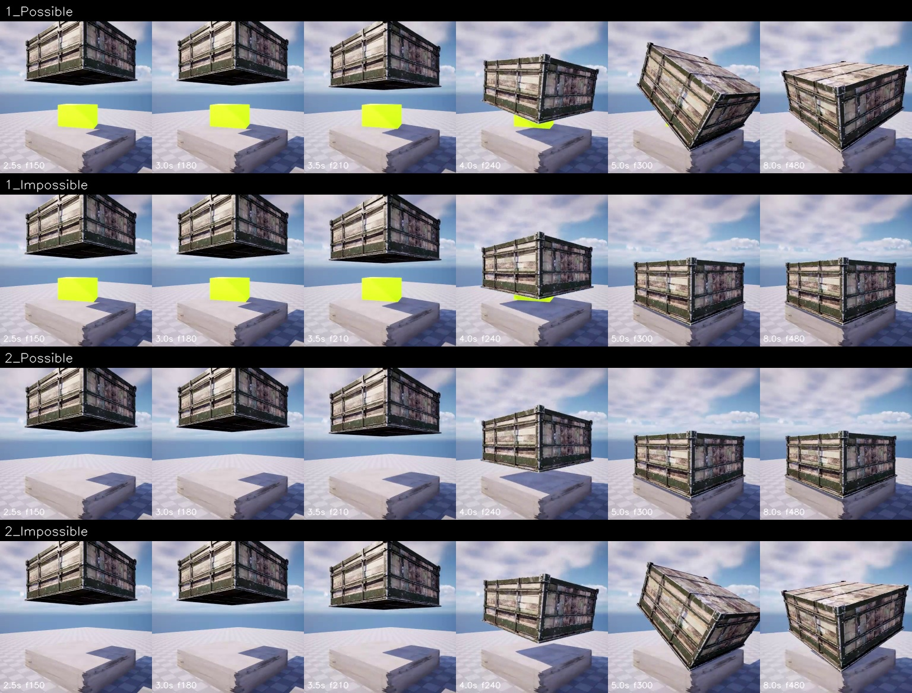

# debug:1 / solidity — 人工审核稿

> 状态：视频与 metadata 自动验证通过；事件语义为 provisional，等待人工审核。

- Scene family：`SolidityFallingFlat`
- Camera / difficulty：`Fixed` / `Easy`
- 物理不变量：碰撞响应必须与可见实体接触一致

## 对照帧

行顺序固定为 `1_Possible / 1_Impossible / 2_Possible / 2_Impossible`；每格标注秒数和源帧编号。

## Pair 判读

| Pair | Possible | Impossible |
|---:|---|---|
| 1 | 落点有黄色方块；箱体接触后明显倾转，表现出实体碰撞响应。 | 落点有黄色方块；箱体仍直立占据该落点，黄色方块被视觉上吞没。 |
| 2 | 落点没有黄色方块；箱体直立落到平台并保持稳定。 | 落点没有黄色方块；箱体却在同一位置发生类似碰撞后的倾转。 |

## Schema 边界

- Trigger：大型箱体下落到平台上的固定落点；该落点可能有或没有一个可见黄色方块。
- Expectation：存在黄色方块时，箱体不能占据同一空间并应出现相应碰撞响应；不存在方块时，不应受到来自空位置的碰撞冲量。
- Violation A：箱体在可见黄色方块所在位置保持直立落下，缺少排斥或碰撞响应。
- Violation B：落点没有黄色方块时，箱体却发生与撞击方块相似的倾转。

## 特别说明

本场景依赖对碰撞响应而非单帧重叠的判断，是 pilot 中最需要人工确认的语义标注。

## 请审核

1. 对象、颜色、容器位置或碰撞事件的描述是否与视频一致；
2. Possible 是否提供了不变量成立的正对照，而非仅仅没有异常；
3. 两个 Impossible 是否确实属于同一 condition 的互补违规；
4. 当前规则是否混入了具体标签而没有视觉证据。
