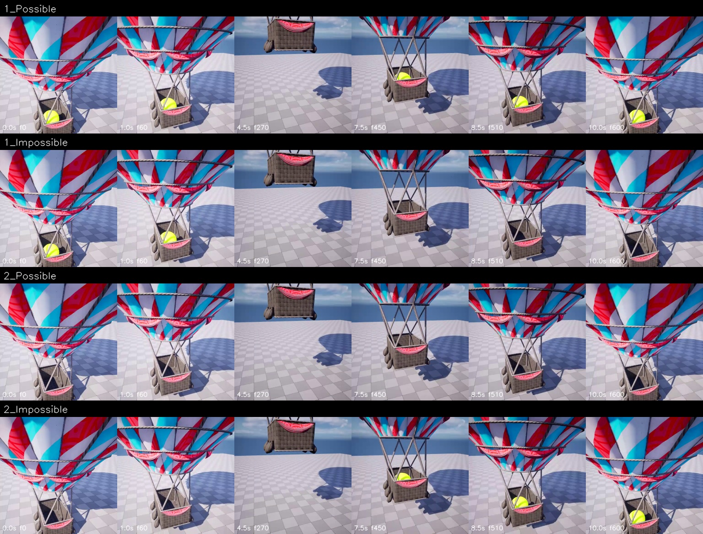

# debug:3 / permanence — 人工审核稿

> 状态：视频与 metadata 自动验证通过；事件语义为 provisional，等待人工审核。

- Scene family：`HotAirBallonTwoDist`
- Camera / difficulty：`Fixed` / `Easy`
- 物理不变量：遮挡不会创造或抹除物体

## 对照帧

行顺序固定为 `1_Possible / 1_Impossible / 2_Possible / 2_Impossible`；每格标注秒数和源帧编号。

## Pair 判读

| Pair | Possible | Impossible |
|---:|---|---|
| 1 | 黄色球在遮挡前可见，热气球转回后同一黄色球再次可见。 | 黄色球在遮挡前可见，但热气球转回后球不再出现。 |
| 2 | 遮挡前后均未观察到黄色球，没有新增目标物体。 | 遮挡前未观察到黄色球，遮挡结束后篮中出现黄色球，且没有可见进入路径。 |

## Schema 边界

- Trigger：目标物体及其容器经历一段暂时遮挡，且没有可见的进入、离开或销毁事件。
- Expectation：遮挡前存在的物体在遮挡后仍应存在；遮挡前不存在的物体不能在遮挡后凭空出现。
- Violation A：可见物体进入遮挡后永久消失。
- Violation B：遮挡结束后出现此前不存在且无进入路径的物体。

## 请审核

1. 对象、颜色、容器位置或碰撞事件的描述是否与视频一致；
2. Possible 是否提供了不变量成立的正对照，而非仅仅没有异常；
3. 两个 Impossible 是否确实属于同一 condition 的互补违规；
4. 当前规则是否混入了具体标签而没有视觉证据。
