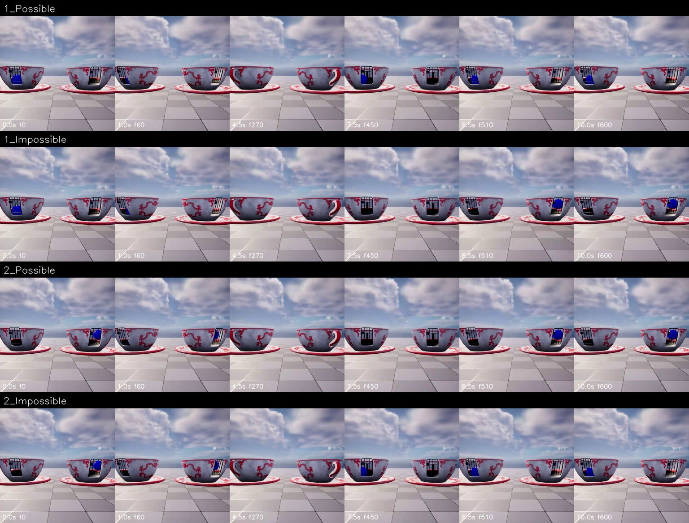

# main_300:19 / continuity — 人工审核稿

> 状态：视频与 metadata 自动验证通过；事件语义为 provisional，等待人工审核。

- Scene family：`RotatingCup`
- Camera / difficulty：`Fixed` / `Easy`
- 物理不变量：物体不能在分离容器之间无路径换位

## 对照帧

行顺序固定为 `1_Possible / 1_Impossible / 2_Possible / 2_Impossible`；每格标注秒数和源帧编号。

## Pair 判读

| Pair | Possible | Impossible |
|---:|---|---|
| 1 | 蓝色方块遮挡前后都位于左侧杯位。 | 蓝色方块遮挡前位于左侧杯位，之后直接出现在右侧杯位。 |
| 2 | 蓝色方块遮挡前后都位于右侧杯位。 | 蓝色方块遮挡前位于右侧杯位，之后直接出现在左侧杯位。 |

## Schema 边界

- Trigger：蓝色方块在两个空间分离的杯位之一进入遮挡，且没有可见的跨杯通道或转移过程。
- Expectation：方块重新可见时仍应位于遮挡前的同一杯位；若换到另一杯位，必须存在连续转移路径。
- Violation A：方块由左杯消失并直接在右杯出现。
- Violation B：方块由右杯消失并直接在左杯出现。

## 请审核

1. 对象、颜色、容器位置或碰撞事件的描述是否与视频一致；
2. Possible 是否提供了不变量成立的正对照，而非仅仅没有异常；
3. 两个 Impossible 是否确实属于同一 condition 的互补违规；
4. 当前规则是否混入了具体标签而没有视觉证据。
