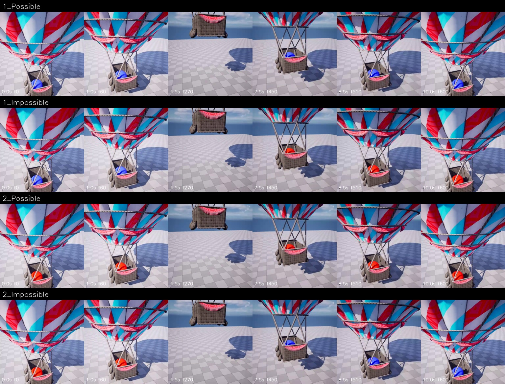

# main_300:21 / immutability — 人工审核稿

> 状态：视频与 metadata 自动验证通过；事件语义为 provisional，等待人工审核。

- Scene family：`HotAirBallon`
- Camera / difficulty：`Fixed` / `Easy`
- 物理不变量：暂时遮挡不改变物体的稳定属性

## 对照帧

行顺序固定为 `1_Possible / 1_Impossible / 2_Possible / 2_Impossible`；每格标注秒数和源帧编号。

## Pair 判读

| Pair | Possible | Impossible |
|---:|---|---|
| 1 | 球在遮挡前后均为蓝色。 | 球在遮挡前为蓝色，重新出现后变为红色。 |
| 2 | 球在遮挡前后均为红色。 | 球在遮挡前为红色，重新出现后变为蓝色。 |

## Schema 边界

- Trigger：同一球体进入暂时遮挡，期间没有可见的涂色、替换或变形过程。
- Expectation：球体重新出现时应保持遮挡前可识别的颜色属性。
- Violation A：蓝色球在无遮挡的因果过程下变为红色。
- Violation B：红色球在无遮挡的因果过程下变为蓝色。

## 请审核

1. 对象、颜色、容器位置或碰撞事件的描述是否与视频一致；
2. Possible 是否提供了不变量成立的正对照，而非仅仅没有异常；
3. 两个 Impossible 是否确实属于同一 condition 的互补违规；
4. 当前规则是否混入了具体标签而没有视觉证据。
