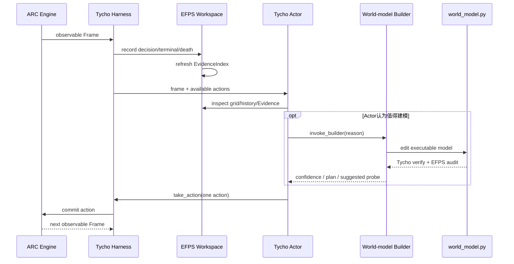

# V3 架构与协作指南：Tycho 主干上的可执行 EFPS

日期：2026-09-02

## 1. 一句话结论

V3 是 **Tycho 控制与执行系统 + 嵌入同一世界模型的 EFPS 认知视图**。

- Tycho 负责观察、行动、workspace、可执行世界模型、回放验证、搜索规划、上下文、预算、恢复和实验记录。
- EFPS 负责把世界模型中的一部分知识表达为带真实 Evidence 的两种结构：
  `Entity -> Prototype` 分类，以及可执行的 `Prototype + Action -> Output` Schema。
- `world_model.py` 是唯一动力学真相；EFPS manifest 是从该程序导出的审计视图，不是第二套可独立更新的 graph。

因此，V3 不是“Tycho 和旧 EFPS 各自预测一次再投票”，也不是把 V2 的
Actor/Exploration/Update 三连调用原样嵌入 Tycho。

## 2. 两者的职责边界

| 问题 | Tycho | EFPS 扩展 |
|---|---|---|
| 谁能操作游戏 | Actor 是唯一环境行动者 | 不直接提交动作 |
| 谁维护动力学 | `world_model.py` 的 `State/init_state/transition/render/outcome` | Schema handler 必须实际参与同一个 `transition()` |
| 谁建立模型 | orchestrator 模式下 Actor 按需调用 Builder | 给 Builder 提供 Prototype/Schema 表达和审计合同 |
| 什么是真实证据 | Tycho workspace 中的 decision、terminal、death、animation、reset archive | 为这些记录生成稳定 `EvidenceRef`，禁止模拟状态进入 Evidence |
| 如何检验模型 | Tycho replay verifier、outcome 检查和 planner | Evidence closure、Prototype/Schema 冲突、handler linkage、model hash 审计 |
| 如何规划 | Tycho 从当前 threaded state 调用 BFS/A*/自定义 planner | 被触发的 Schema rule 是 transition 的一部分，可被同一个 planner 多步执行 |
| 如何持久化 | workspace、journal、snapshot、run spec、manifest | `notes/evidence_index.json` 与派生的 `notes/efps_manifest.json` |

最重要的不变量是：

```text
真实 ARC 观察 ──> Tycho workspace ──> Evidence IDs
                         │
                         v
                   world_model.py
                 /        |        \
        Tycho verifier   planner   EFPS audit view
```

三个消费者读取的是同一个 `world_model.py`，所以不会出现“Schema 说向右移动，但 planner
执行的 Python 却向左移动”的双源漂移。

## 3. 从 V2 到 V3 的概念映射

V2 中值得保留的研究对象，被压缩到 Tycho 可执行模型里：

| V2 概念 | V3 表示 | 变化 |
|---|---|---|
| Entity | `EntityInstance` | 只保留当前模型需要的属性、Evidence 和 Prototype membership |
| Prototype | `@prototype` 注册的 matcher | 不只是名字；matcher 必须能执行分类 |
| Schema 三元组 | `@schema_rule` 注册的 handler | `Prototype + Action -> Output` 同时有自然语言 Output 和实际状态转移代码 |
| Evidence | `EvidenceRef/EvidenceIndex` | 来源改为 Tycho 的真实 workspace 记录，ID 与内容 hash 绑定 |
| Insight：动力学 | `transition()` 普通分支或 Schema handler | 不再维护另一张全局图 |
| Insight：目标/死亡 | `outcome()` | 与 dynamics 独立验证 |
| Insight：策略/分解 | `subgoals()/heuristic()/planner.py` | 供普通搜索直接使用 |
| 未证实假设 | `notes/world_model.md` | 不能伪装成已验证 Schema |
| Exploration/Main/Update | Tycho Actor + 按需 Builder | 不再固定每个动作调用三个 Agent |

EFPS 仍然回答原来的两个核心研究问题：

1. 哪些 Entity 属于同一类可复用 Prototype？
2. 某类 Prototype 在一个公开 Action 下产生什么可观察 Output？

但答案现在必须能够被 Python 执行、被历史轨迹反驳、被 planner 使用。

## 4. 代码是如何接起来的

### 4.1 入口和 approach 注册

`socialclaw.run_arc_v3` 是项目入口。它：

1. 检查 Python 3.12 和 ARC/Tycho 关键依赖版本；
2. 把 V2 常用的 OpenRouter/OpenAI-compatible 参数映射到 Tycho transport；
3. 默认选择 `--approach tycho_efps` 与 `TYCHO_MODE=orchestrator`；
4. 指向仓库已有的 ARC environment inventory；
5. 最终调用 Tycho parallel harness。

`tycho/harness/_run_extension.py` 把 `tycho_efps` 注册到
`socialclaw.v3.agent`，并把 `socialclaw/v3` 与实际游戏源码 hash 加入不可变 run spec。
因此修改 EFPS policy 或本地游戏实现后，旧 run 不能静默 resume 成混合实验。

### 4.2 Agent 融合点很窄

`EFPSTychoAgent` 直接继承 `TychoAgent`，没有复制 Tycho 的决策循环，只替换两个 class attribute：

```python
class EFPSTychoAgent(TychoAgent):
    workspace_class = EFPSGameWorkspace
    executor_class = EFPSToolExecutor
```

这意味着 Actor 的视觉输入、tool loop、Builder 调用、action 提交、history、budget 和 resume
仍然来自 Tycho。EFPS 不维护另一份 Agent 状态机。

该 subclass 还实现了 `note_final_observation()`：当 bounded run 恰好因 action limit 停止时，
把最后一个动作产生的非终态画面写入 Evidence，避免丢失最后一个 Schema 反例。

### 4.3 Workspace 融合

每个游戏开始时，`EFPSGameWorkspace` 先调用 Tycho 原始 workspace 初始化，再额外放入：

```text
ws/<game>/
├── world_model.py              # 唯一动力学模型，Tycho 创建/Builder 编辑
├── wmlib.py                    # Tycho 历史读取库，追加 evidence_refs()
├── verify.py / plan.py         # Tycho verifier 与 planner
├── efps_runtime.py             # 可执行 EFPS 类型、registry、decorator
├── efps_audit.py               # 导出并验证 EFPS manifest
├── level_*/turn_*.{json,txt}   # 真实 decision observations
├── attempts/...                # RESET 前的历史尝试
└── notes/
    ├── evidence_index.json     # harness-authored Evidence，模拟器不能写
    ├── efps_contract.md        # Builder 应遵循的融合合同
    └── efps_manifest.json      # audit 通过后生成的派生视图
```

每次 Tycho 写入普通 observation、通关 terminal、GAME_OVER、animation 或 reset archive 后，
workspace 都重新建立 Evidence index。Evidence ID 绑定 run、game、role、level、attempt、turn、
公开 action、相对路径和 frame hash，不绑定机器绝对路径。

### 4.4 世界模型中的 EFPS

理想的 agent-authored `world_model.py` 会使用下面这种结构：

```python
import efps_runtime

@efps_runtime.prototype(
    "moving_piece",
    description="可由方向动作移动的彩色棋子",
    evidence_ids=["evi_..."],
)
def is_moving_piece(entity):
    return entity.attributes.get("movable") is True

@efps_runtime.schema_rule(
    "move_piece_right",
    prototype_id="moving_piece",
    action={"action": "ACTION4"},
    output="棋子向右移动一格，墙会阻挡",
    evidence_ids=["evi_..."],
)
def move_piece_right(state, entity, action):
    # 真正修改 state；不是只写一段描述。
    return apply_right_move(state, entity)

def efps_entities(state):
    return [
        efps_runtime.EntityInstance(
            entity_id="player",
            attributes={"movable": True},
            evidence_ids=("evi_...",),
        )
    ]

def transition(state, action):
    next_state = clone_state(state)
    entities = efps_runtime.REGISTRY.classify(efps_entities(next_state))
    return efps_runtime.REGISTRY.apply_rules(next_state, action, entities).state
```

Prototype matcher 决定同类性；Schema handler 决定状态如何变化；Output 是对该 handler
可观察效果的说明。`apply_rules()` 返回实际触发的 Schema IDs，避免仅凭 manifest 猜测 attribution。

普通 Python transition 分支仍然允许存在，因为 UI、计数器、cellular automaton 或 hidden mode
未必适合强制对象化。模型必须用 `EFPS_APPLICABILITY=full|partial|not_applicable` 说明使用范围，
而不是为了指标制造虚假 Entity。

### 4.5 双重验证顺序

当 Builder 实质修改 `world_model.py` 时，`EFPSToolExecutor` 首先调用 Tycho 原有反馈：

1. 导入并执行模型；
2. 在已观察 transition 上 replay，检查 render/dynamics coverage；
3. 检查 outcome，并尝试从当前 state 规划。

随后执行 `efps_audit.py`：

1. 读取真实 `evidence_index.json`；
2. 检查每个 Entity、Prototype、Schema 引用的 Evidence 是否存在；
3. 拒绝同一个 `Prototype + Action` 的重复或冲突 Output；
4. 确认 Schema 对应 callable handler；
5. 导出绑定 `world_model.py` SHA-256 的 `efps_manifest.json`。

Tycho verifier 通过只说明模型与已见轨迹相容；EFPS audit 通过只说明认知结构闭合且可执行。
两者都不能单独证明未知分支正确或目标可达，因此 outcome gate 和 validated plan gate 仍须独立保留。

## 5. 一次动作的完整生命周期



Builder 不能操作环境；Actor 每回合只提交一个动作。规划 rollout 只存在于 sandbox 内，不进入
EvidenceIndex。真实下一帧不符合预测时，模型和计划必须被重新检查。

## 6. 当前融合程度：已经有的与还没有的

### 已完成：表示层、证据层和执行层融合

- `tycho_efps` approach 能通过正式 Tycho harness 运行；
- 真实 workspace 自动产生稳定 Evidence；
- Prototype matcher 和 Schema handler 可以直接参与 transition；
- 模型编辑会同时收到 Tycho verifier 与 EFPS audit；
- experiment limits、游戏源码和 EFPS policy 都进入不可变 run identity；
- Docker 不可访问时可使用经过实时策略检查的 Bubblewrap sandbox；
- 全仓测试当前为 282 passed、2 skipped。

### 尚未完成：策略层融合（Phase 3）

当前 Actor/Builder 的主 prompt 仍基本是 Tycho prompt。EFPS contract 虽已放进 workspace，
但系统没有强制 Builder 主动读取它、创建 Prototype/Schema、运行 `efps_audit.py`，也没有要求
Actor 根据 Schema attribution 选择探索动作。

2026-09-01 的 CD82 五动作 smoke 清楚地暴露了这一点：

- pipeline、provider、sandbox、action cap 都正常；
- Actor 执行了五个动作，Level 1 未通过；
- `builder_invocations=0`；
- `world_model.py` 保持初始空 transition；
- 没有生成 `notes/efps_manifest.json`。

所以现在可以说“EFPS runtime 已嵌入 Tycho”，不能说“EFPS 已经参与了这次游戏推理”，更不能用
该 smoke 判断 EFPS 是否提高性能。

Phase 3 至少需要：

1. Builder prompt 明确读取 Evidence/EFPS contract，并先判断 applicability；
2. 有证据时优先把可对象化机制写成 executable Prototype/Schema，而不是只写普通分支；
3. 每次模型修改后要求 audit 成功，失败报告返回 Actor；
4. Actor 在出现 informative transition、misprediction、重复/no-op 或 plan failure 时调用 Builder；
5. 把 builder fire、Schema attribution、unattributed transition、membership churn 和 prototype reuse
   汇总到 run-level manifest。

## 7. 仓库所有权与协作规则

### 目录边界

| 路径 | 所有权/用途 | 修改要求 |
|---|---|---|
| `tycho/` | pinned Tycho 主干与少量集成 patch | 尽量不改；任何差异必须登记到 patch inventory |
| `third_party/tycho/` | upstream commit、LICENSE、release manifest、原始 tests | 升级必须整体审计，不能零散覆盖 |
| `socialclaw/v3/` | 本项目 EFPS 扩展 | 新功能优先放这里 |
| `socialclaw/v2/` | 历史 V2 实现 | V3 不应重新依赖其 graph/agent loop |
| `configs/v3/` | 可审计运行配置 | 不放 API key、输出目录或私人机器信息 |
| `tests/v3/` | 融合层合同测试 | 新 Evidence/Schema/runner 行为必须补测试 |
| `docs/` | 架构、状态、项目记忆 | 设计或实验语义变化必须同步更新 |

### 修改 Tycho 时的规则

`third_party/tycho/UPSTREAM.md` 是 patch inventory。若确实需要修改 `tycho/`：

1. 先证明不能通过 `socialclaw/v3` subclass/hook 完成；
2. 保持改动窄且默认 `tycho` approach 行为不变；
3. 将修改文件加入 upstream snapshot 例外列表；
4. 在 patch inventory 写明原因和行为边界；
5. 同时运行 upstream parity tests 与 V3 tests。

### 提交前最低检查

```bash
.venv/bin/python -m pip check
.venv/bin/python -m socialclaw.run_arc_v3 --check-runtime
TYCHO_SANDBOX_RUNTIME=bwrap .venv/bin/python -m tycho.workspace.sandbox doctor
.venv/bin/python -m pytest -q
git diff --check
```

不要把 `.env`、`.venv*` 或 `outputs/` 推到 GitHub。需要共享实验时，应提交脱敏、压缩、带
run spec/config/hash 的 reproduction bundle，而不是整个本地运行目录。

## 8. 建议的下一批协作任务

1. **Phase 3 prompt owner**：实现 Builder/Actor 的 EFPS-aware policy，并做 golden prompt tests。
2. **Attribution owner**：将每次真实/模拟 transition 的 applied Schema IDs 汇总成 coverage。
3. **Diagnostics owner**：实现 repeated state-action、oscillation、stale plan 和 no-information probe。
4. **Experiment owner**：在相同 model/game/action/inference budget 下比较 upstream Tycho 与
   `tycho_efps`，先做 CD82，再扩 SK48/TU93。
5. **Upstream sync owner**：监控 Tycho 新版本，但独立 PR 更新 pin、manifest、patch inventory
   和 parity，不与 EFPS policy 重写混在一起。

协作者开始开发前，应先阅读本文件、`v3_implementation_status.md`、
`third_party/tycho/UPSTREAM.md` 和对应测试。设计原则若发生变化，先更新文档和验收条件，再扩实验。
